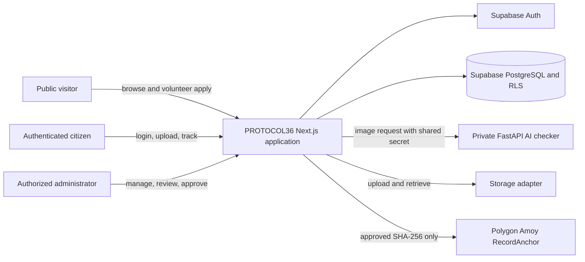
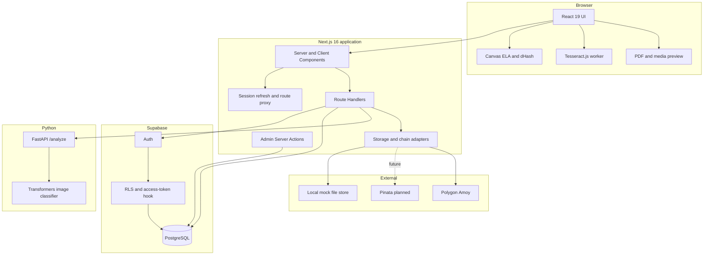
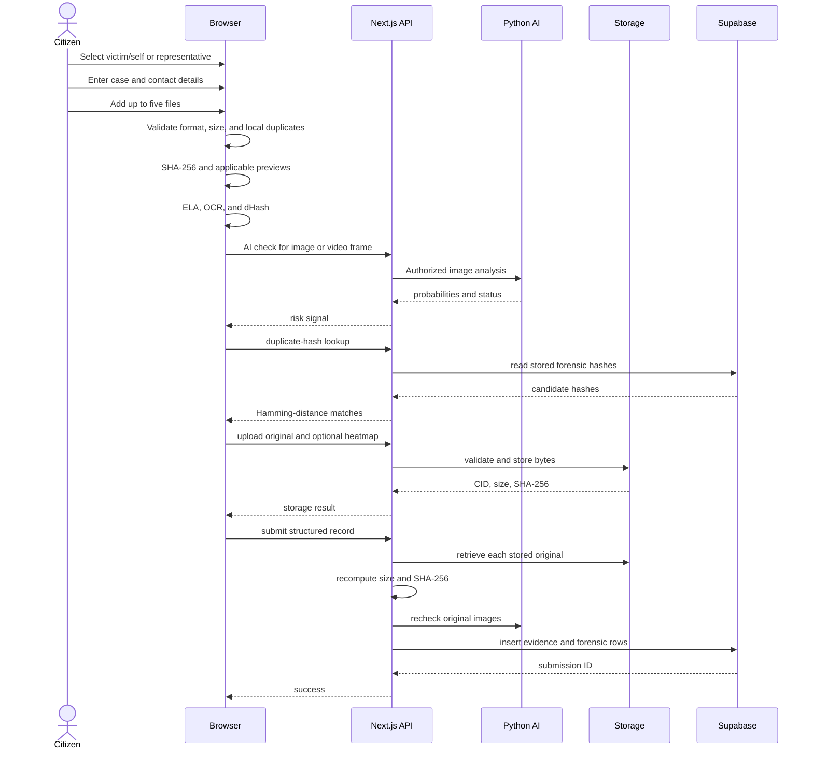
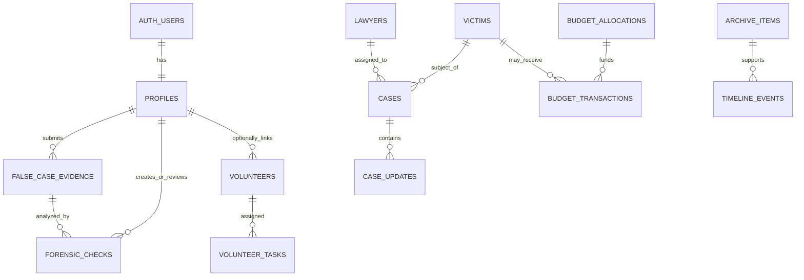

# PROTOCOL36 System Design and Technical Documentation

**Document status:** As-built system documentation  
**System:** PROTOCOL36  
**Repository:** `lamlam25/PROTOCOL`  
**Reviewed against source:** 30 July 2026  
**Default language:** Bangla (`bn`)  
**Secondary language:** English (`en`)

> This document describes the code that exists in the repository, not only the
> original product idea. It marks incomplete production integrations explicitly.
> Passwords, API keys, private keys, service-role tokens, and shared secrets are
> intentionally excluded.

## 1. Executive Summary

PROTOCOL36 is a bilingual accountability, rehabilitation, justice, evidence, and
historical archive platform for Bangladesh's July 2024 mass uprising. It combines:

- a public information portal;
- separate citizen and administrator authentication;
- a private victim/representative evidence-submission workflow;
- browser-based forensic preprocessing;
- a private Python image-authenticity screening service;
- administrator review queues;
- content and case-management tools;
- public budget transparency;
- adapter-based decentralized storage;
- tamper-evident blockchain anchoring on Polygon Amoy.

The system uses a Next.js web application as its primary runtime, Supabase for
authentication and PostgreSQL data, a FastAPI service for AI-image screening, and
a Solidity contract for public hash anchoring.

The core security principle is that forensic tools and blockchain records provide
signals and tamper evidence, not automatic truth. Final evidence decisions remain
with an authorized human reviewer.

## 2. Product Purpose

### 2.1 Problems Addressed

PROTOCOL36 is intended to reduce several information and justice gaps:

1. Victim records, case progress, historical material, and aid spending can be
   fragmented across organizations and files.
2. Citizens may have evidence but lack a structured, private submission channel.
3. Duplicate, manipulated, or AI-generated media can waste reviewer time or support
   false claims.
4. Public fund allocation and disbursement can be difficult to inspect.
5. Digital records can be changed after review unless an external fingerprint is
   preserved.
6. Volunteers need a clear way to apply, and administrators need a dispatch system.

### 2.2 Design Response

The system responds with:

- structured public records and bilingual presentation;
- authenticated, owner-linked evidence submissions;
- SHA-256, ELA, OCR, dHash, metadata, and AI-screening signals;
- private admin queues with explicit approve/reject decisions;
- public budget allocations, transactions, and flow visualization;
- content hashes anchored on a public blockchain after approval;
- a volunteer application and task-management workflow.

### 2.3 Non-Goals

The current system does not:

- prove that an image or video is authentic;
- replace police, court, medical, or legal investigation;
- store private evidence directly on a blockchain;
- provide automatic legal verdicts;
- provide production-grade video deepfake detection;
- verify citizen email ownership while transactional email is unavailable;
- provide a completed production IPFS/Pinata adapter;
- host the Python AI model inside Vercel.

## 3. People, Roles, and Responsibility

### 3.1 Project Roles

| Role | Responsibility |
|---|---|
| Product owner/requester | Defined the PROTOCOL36 concept, target users, functional requirements, branding, admin identity, and workflow corrections |
| Implementation support | Codex analyzed the repository and implemented the web, authentication, forensics, AI-service integration, schema, contract, and fixes in the shared workspace |
| Git contributors | Repository history currently attributes commits to the configured `lamlam25` and `Sumaiya Islam Lamia` Git identities |
| Platform administrator | Controls Supabase, Vercel, storage provider, AI service, Polygon wallet, secrets, content publication, and evidence decisions |
| Human forensic reviewer | Interprets technical signals and approves or rejects evidence |
| Citizen | Browses public material and, after login, submits and tracks owned evidence |
| Volunteer applicant | Applies without needing an account |

Git author information records the configured commit identity. It does not by itself
prove which human or automation authored each line. Product decisions came from the
requester; implementation was performed interactively in the shared repository.

### 3.2 Application Access Roles

#### Public visitor

- No login required.
- Can browse victims, cases, false-case information, budgets, stories, timeline,
  about content, and the volunteer form.
- Can submit a volunteer application.
- Cannot read private evidence or administrator data.

#### Citizen

- Creates an email/password account or signs in.
- Can open the protected evidence uploader.
- Must first state whether they are the victim/accused person or a representative.
- Can upload supported evidence and track their own submissions.
- Cannot access another citizen's evidence or administrator routes.

#### Administrator

- Uses a separate email/password login.
- Must have `admin` in the Supabase JWT `app_metadata.role` claim.
- Can see citizen counts, sign-in activity, evidence counts, and pending reviews.
- Can manage victims, cases, lawyers, archives, timeline entries, volunteers, and
  volunteer tasks.
- Can review false-case submissions and forensic signals.
- Can approve a forensic record and anchor its SHA-256 fingerprint.

There is no separate database login role for lawyers or volunteers.

## 4. Functional Scope and Current Status

| Capability | Status | Notes |
|---|---|---|
| PROTOCOL36 branding | Implemented | Page metadata and home-page H1 use PROTOCOL36 |
| Red, black, green, white visual system | Implemented | Light and dark tokens are defined in global CSS |
| Bangla and English | Implemented | Bangla is always the default locale |
| Public victim registry | Implemented | Only verified and published records are public |
| Public case tracker | Implemented | Cases, lawyer assignment, victim link, and dated updates |
| False-case support page | Implemented | Public explanation plus protected submission path |
| Citizen account and login | Implemented | Password-based; no SMTP dependency |
| Citizen evidence history | Implemented | RLS restricts citizens to their own rows |
| Images, PDF, video, audio, documents | Implemented | Maximum five files and 100 MB combined |
| ELA | Implemented for images | Heuristic client-side Canvas analysis |
| OCR | Implemented for images/PDF first page | Tesseract.js with Bangla and English |
| Perceptual duplicate detection | Implemented | 64-bit dHash stored in the `phash` field |
| AI image screening | Implemented in code | Requires separately hosted Python service |
| Video authenticity screening | Partial | One frame uses image model; metadata markers are scanned |
| Private admin review | Implemented | Evidence and per-file forensic queues |
| Blockchain contract | Implemented and deployed to Amoy | Approval can anchor one file hash |
| Mock storage | Implemented | Local filesystem only; suitable for development |
| Production Pinata storage | Not implemented | Environment fields exist, but no Pinata adapter exists |
| Public budget view | Implemented | Allocation totals, disbursements, table, Sankey |
| Admin budget editor | Not implemented | Data must currently be seeded or managed in Supabase |
| Volunteer application | Implemented | Anonymous public insert |
| Volunteer task dispatch | Implemented for admin | Includes Leaflet map and coordinates |
| Password reset | Not implemented in UI | SMTP-independent reset flow is absent |
| Email ownership verification | Temporarily bypassed | Citizen accounts are server-created as confirmed |

## 5. System Context



### 5.1 Trust Boundaries

1. **Browser boundary:** client-side forensic results can be modified by a hostile
   browser and must not be treated as authoritative.
2. **Next.js server boundary:** route handlers validate sessions, origin, input,
   storage content, and rate limits.
3. **Supabase boundary:** Auth issues tokens; PostgreSQL RLS enforces row access.
4. **Service-role boundary:** the service-role key bypasses RLS and must remain
   server-only.
5. **AI-service boundary:** access is protected by a shared secret; it must not be
   exposed directly to browsers.
6. **Storage boundary:** uploaded bytes may be outside the database; integrity is
   checked using the recorded SHA-256.
7. **Blockchain boundary:** public records are immutable testnet fingerprints, not
   private evidence files.

## 6. Container Architecture



## 7. Technology Stack

| Layer | Technology | Purpose |
|---|---|---|
| Web framework | Next.js 16.2.12 App Router | Server rendering, routing, API handlers, server actions |
| UI runtime | React 19.2.4 | Interactive application UI |
| Language | TypeScript 5, strict mode | Web application implementation |
| Styling | Tailwind CSS 4 | CSS-first design tokens and responsive styles |
| Components | shadcn 4 / Base UI | Accessible primitives |
| Icons | Lucide React | Standard icon system |
| Localization | next-intl 4.13 | Bangla/English routing and messages |
| Authentication | Supabase Auth | Password sessions and JWT claims |
| Database | Supabase PostgreSQL | Relational application data |
| Authorization | PostgreSQL RLS | Row-level access enforcement |
| Validation | Zod, React Hook Form | Server and client input validation |
| OCR | Tesseract.js 7 | Browser-side Bangla/English text extraction |
| PDF rendering | pdfjs-dist 6 | First-page browser preview |
| Charts | Recharts 3 | Budget Sankey visualization |
| Maps | Leaflet / React Leaflet | Volunteer task location and dispatch |
| Blockchain client | Ethers 6 | Contract writes and verification |
| Contract toolchain | Solidity 0.8.28, Hardhat 3 | RecordAnchor compilation, test, deployment |
| AI API | Python, FastAPI, Uvicorn | Private inference microservice |
| AI model runtime | PyTorch, Transformers, Pillow | Image classification and safe decoding |
| Hosting target | Vercel | Next.js production deployment |
| Database/Auth hosting | Supabase | Managed database and identity |
| CI | GitHub Actions | Lint, type, localization, and contract tests |

The repository pins Node.js 24 through `.nvmrc`.

## 8. Repository Structure

```text
.
|-- src/
|   |-- app/
|   |   |-- [locale]/                 localized pages and layouts
|   |   |-- api/                      server route handlers
|   |   |-- robots.ts                 crawler rules
|   |   `-- sitemap.ts                localized public URLs
|   |-- components/                   feature and UI components
|   |-- i18n/                         locale routing and message loading
|   |-- lib/
|   |   |-- admin/                    auth-user reporting
|   |   |-- chain/                    mock and Polygon adapters
|   |   |-- forensics/                ELA, OCR, dHash, hashes, previews
|   |   |-- storage/ipfs/             mock storage adapter and URL helpers
|   |   `-- supabase/                 browser, SSR, proxy, admin clients
|   |-- proxy.ts                      Next.js 16 request proxy
|   `-- types/                        database and module declarations
|-- messages/{bn,en}/                 localized JSON namespaces
|-- supabase/
|   |-- migrations/                   schema, RLS, auth hook, intake changes
|   |-- templates/                    optional magic-link email template
|   |-- config.toml                   local Supabase configuration
|   `-- seed.sql                      intentionally empty local seed
|-- services/ai_checker/              FastAPI image screening service
|-- contracts/
|   |-- contracts/RecordAnchor.sol    Solidity contract
|   |-- test/                         Hardhat contract tests
|   |-- scripts/deploy.ts             Amoy deployment
|   `-- deployments/amoy.json         public deployment metadata
|-- scripts/                          admin seed, demo seed, RLS/i18n checks
|-- public/                            hero and map assets
|-- .github/workflows/ci.yml          CI pipeline
|-- .env.example                      configuration contract
|-- package.json                      web commands and dependencies
`-- README.md                         quick-start summary
```

## 9. Web Route Catalog

Every page route is prefixed with `/bn` or `/en`.

### 9.1 Public Pages

| Route | Purpose | Login |
|---|---|---|
| `/[locale]` | Home dashboard, statistics, latest cases, budget summary, feature links | No |
| `/[locale]/about` | Mission and project context | No |
| `/[locale]/victims` | Published martyr and injured-person list | No |
| `/[locale]/victims/[id]` | Victim detail and related public cases | No |
| `/[locale]/cases` | Published case list | No |
| `/[locale]/cases/[id]` | Case, victim, assigned lawyer, and progress timeline | No |
| `/[locale]/false-cases` | False-case support and evidence workflow overview | No |
| `/[locale]/budget` | Allocations, spending, Sankey flow, transaction ledger | No |
| `/[locale]/volunteers` | Centered volunteer application | No |
| `/[locale]/stories` | Verified JulyStories archive | No |
| `/[locale]/stories/[id]` | Archive record detail and media/source data | No |
| `/[locale]/timeline` | Chronological public event archive | No |

### 9.2 Authentication and Citizen Pages

| Route | Purpose | Access |
|---|---|---|
| `/[locale]/citizen/login` | Citizen sign-in or account creation | Public |
| `/[locale]/login` | Separate administrator sign-in | Public |
| `/[locale]/callback` | Optional PKCE/token-hash email callback retained for future use | Public entry |
| `/[locale]/citizen` | Citizen portal and owned-submission history | Authenticated |
| `/[locale]/false-cases/submit` | Victim-first private evidence uploader | Authenticated |

### 9.3 Administrator Pages

| Route | Purpose |
|---|---|
| `/[locale]/admin` | Redirects to admin dashboard |
| `/[locale]/admin/dashboard` | Citizen, sign-in, evidence, and review metrics |
| `/[locale]/admin/users` | Citizen auth users, join date, last sign-in, evidence count |
| `/[locale]/admin/victims` | Victim registry list |
| `/[locale]/admin/victims/new` | Create victim |
| `/[locale]/admin/victims/[id]` | Edit, verify, and publish victim |
| `/[locale]/admin/cases` | Case list |
| `/[locale]/admin/cases/new` | Create case |
| `/[locale]/admin/cases/[id]` | Edit case and manage progress updates |
| `/[locale]/admin/lawyers` | Lawyer directory |
| `/[locale]/admin/lawyers/new` | Add lawyer |
| `/[locale]/admin/lawyers/[id]` | Edit lawyer |
| `/[locale]/admin/false-cases` | Private false-case submission queue |
| `/[locale]/admin/false-cases/[id]` | Submission detail, files, notes, and status |
| `/[locale]/admin/forensics` | Per-file forensic review queue |
| `/[locale]/admin/forensics/[id]` | Original, ELA, OCR, duplicate, AI, and chain detail |
| `/[locale]/admin/volunteers` | Volunteer application queue |
| `/[locale]/admin/volunteers/[id]` | Applicant detail and status |
| `/[locale]/admin/volunteer-tasks` | Field-task list and dispatch map |
| `/[locale]/admin/volunteer-tasks/new` | Create and assign task |
| `/[locale]/admin/volunteer-tasks/[id]` | Edit task |
| `/[locale]/admin/archive` | JulyStories management |
| `/[locale]/admin/archive/new` | Create archive item |
| `/[locale]/admin/archive/[id]` | Edit, verify, and publish archive item |
| `/[locale]/admin/timeline` | Timeline management |
| `/[locale]/admin/timeline/new` | Create event |
| `/[locale]/admin/timeline/[id]` | Edit event |

## 10. Server API Catalog

| Endpoint | Method | Access | Behavior |
|---|---|---|---|
| `/api/auth/citizen-register` | POST | Public, same-origin | Rate-limited server-side citizen creation |
| `/api/storage/pin` | POST | Authenticated | Validates file type, signature, size, then calls storage adapter |
| `/api/forensics/ai-check` | POST | Authenticated | Proxies a valid image to private Python service |
| `/api/forensics/phash-check` | POST | Authenticated | Compares submitted 64-bit hash with stored hashes |
| `/api/false-cases/submit` | POST | Authenticated | Verifies stored bytes and writes case plus forensic rows |
| `/api/forensics/record` | POST | Authenticated owner | Legacy/compatibility per-file forensic-row writer |
| `/api/dev/local-ipfs/[cid]` | GET | URL holder | Serves mock local evidence in development |

### 10.1 Rate Limits

Rate limits are daily counters keyed by a SHA-256 hash of the client IP:

| Operation | Limit |
|---|---:|
| Citizen registration | 5/day/IP |
| Final false-case submission | 5/day/IP |
| Storage upload | 20/day/IP |
| AI image check | 15/day/IP |
| Duplicate-hash check | 10/day/IP |

These counters are application-level abuse controls, not a replacement for a WAF,
CAPTCHA, account-level quotas, or distributed rate limiting.

## 11. Authentication Design

### 11.1 Current Operational Flow

Password authentication is the active flow because the earlier Supabase email-link
flow encountered provider rate limits and SMTP configuration failures.

#### Citizen registration

1. Citizen opens `/[locale]/citizen/login`.
2. Citizen selects account creation and provides email/password.
3. Password must be 10-72 characters with lowercase, uppercase, and a digit.
4. The browser posts to `/api/auth/citizen-register`.
5. The route checks same-origin and the daily IP limit.
6. A service-role Supabase client creates an email-confirmed user with a forced
   `citizen` role.
7. The route upserts the matching `profiles` row as `citizen`.
8. The browser signs in with `signInWithPassword`.
9. The session cookie is created and the citizen is redirected to the protected
   evidence uploader.

#### Citizen sign-in

1. Browser calls `supabase.auth.signInWithPassword`.
2. Supabase validates credentials.
3. The browser redirects only to an allow-listed localized citizen destination.

#### Administrator sign-in

1. Administrator opens the separate `/[locale]/login` page.
2. Browser calls `signInWithPassword`.
3. The browser immediately reads JWT claims.
4. If `app_metadata.role` is not `admin`, it signs out and rejects access.
5. An approved admin is redirected to `/[locale]/admin/dashboard`.

### 11.2 Route Protection

Protection is layered:

1. `src/proxy.ts` refreshes Supabase cookies and claims for localized page requests.
2. Citizen-only routes redirect unauthenticated users to citizen login.
3. Admin routes require the `admin` JWT claim.
4. `admin/layout.tsx` checks the claim again server-side.
5. Supabase RLS remains the database authorization boundary.
6. Service-role routes perform their own session and ownership checks.

This defense-in-depth design avoids relying on a single proxy check.

### 11.3 Role Claims

The `profiles` table is the durable application-role source. A custom access-token
hook copies the role into `app_metadata.role` when a JWT is issued. The function is
`public.custom_access_token_hook`.

Hosted Supabase must have the custom access-token hook enabled. The admin bootstrap
also writes `app_metadata.role` directly so newly issued admin tokens work even if
the hook is temporarily misconfigured.

### 11.4 Optional Email-Link Compatibility

The callback route still accepts:

- a PKCE authorization `code`; or
- a `token_hash` with `email`/`magiclink` type.

It validates localized destinations and rejects non-admin users entering admin mode.
This is retained for future SMTP restoration; it is not the current login UI.

### 11.5 Authentication Limitations

- Citizen registration sets `email_confirm: true` to avoid broken SMTP.
- Email ownership is therefore not currently verified.
- An email address must not be treated as legal identity proof.
- There is no password-reset page. Lost-password recovery needs an admin procedure
  or restored transactional email.
- Admin accounts are allow-listed through role assignment, not open signup.

## 12. Evidence Submission Workflow



### 12.1 Victim-First Question

The form initially hides detailed fields until the signed-in person chooses:

- `self`: the submitter is the affected/accused person; or
- `representative`: the submitter is acting for another person.

This value is stored as `submitter_relationship`.

### 12.2 Required Submission Data

- accused/victim full name;
- description of at least 10 characters;
- at least one supported evidence file;
- either a contact email or contact phone;
- authenticated user ownership.

Optional fields include Bangla name, case reference, district, alibi timestamp, and
the second contact method.

### 12.3 Supported Files and Limits

| Kind | Formats | Per-file limit | Analysis |
|---|---|---:|---|
| Image | JPEG, PNG, WebP | 20 MB | SHA-256, ELA, OCR, dHash, AI image |
| PDF | PDF | 20 MB | SHA-256, first-page OCR and dHash |
| Video | MP4, WebM, MOV | 75 MB | SHA-256, one-frame dHash/AI, metadata markers |
| Audio | MP3, WAV | 20 MB | SHA-256 only |
| Document | TXT, CSV, RTF, DOC, DOCX | 20 MB | SHA-256 only |

Global limits are five files and 100 MB combined.

The server checks magic-byte/file signatures for supported formats. Extension or
MIME type alone is not accepted as sufficient.

## 13. Forensics and Verification Engine

### 13.1 SHA-256 Fingerprinting

Every original file receives a SHA-256 digest in the browser. The storage adapter
also returns a digest. During final submission, the server retrieves the stored
bytes, recomputes SHA-256, and checks the recorded size.

Purpose:

- detect a changed file between analysis and submission;
- identify an exact file;
- provide the value later anchored to the blockchain.

SHA-256 does not indicate whether content is truthful; it only identifies bytes.

### 13.2 Error Level Analysis

ELA is implemented in the browser with HTML5 Canvas:

1. Decode the original image.
2. Draw it on a Canvas.
3. Re-encode at JPEG quality `0.90`.
4. Compare RGB values pixel by pixel.
5. Amplify each mean pixel difference by `15` for a heatmap.
6. Compute a mean-difference score scaled to 0-100.

Risk thresholds:

| Score | Flag |
|---:|---|
| `< 15` | none |
| `15-39.999` | low |
| `40-64.999` | medium |
| `>= 65` | high |

ELA can flag edits, but ordinary resizing, recompression, screenshots, and repeated
saving can also create high differences. It is a reviewer aid, not proof.

### 13.3 OCR Text Parsing

Tesseract.js runs in a browser worker using `eng` and `ben`.

- Images are recognized directly.
- For PDFs, only the rendered first page is recognized.
- A Bangladesh NID candidate is extracted when a 10, 13, or 17 digit sequence is
  found.
- A date candidate is extracted from common numeric day/month/year patterns.
- The extracted fields are shown for human correction before submission.
- Handwriting accuracy is expected to be weaker than printed text.

OCR data can contain sensitive personal information and remains inside private
evidence records.

### 13.4 Perceptual Duplicate Detection

The request called this pHash, and database/API fields retain the `phash` name. The
implemented algorithm is specifically a 64-bit difference hash, or dHash:

1. Resize a visual preview to 9 by 8 pixels.
2. Convert RGB values to grayscale.
3. Compare each pixel with the pixel to its right.
4. Encode the 64 comparison bits as 16 hexadecimal characters.
5. Compare against stored hashes with Hamming distance.
6. Treat distance `<= 8` as a possible duplicate.

For a PDF this represents the first page. For a video it represents one extracted
frame. dHash is useful for visually similar copies but is less robust to rotation
and major crops than a full DCT-based pHash.

### 13.5 Python AI Image Screening

The browser never calls the Python service directly. It sends an image to the
authenticated Next.js endpoint, which forwards it with a shared secret.

Default model:

`dima806/ai_vs_real_image_detection`

Default thresholds:

- `ai_probability >= 0.85`: `likely_ai`;
- otherwise `real_probability >= 0.85`: `likely_real`;
- otherwise: `inconclusive`.

`review_required` is true for everything except `likely_real`.

Safety limits:

- JPEG, PNG, and WebP only;
- maximum 20 MB;
- maximum 40 million pixels;
- EXIF orientation is normalized;
- inference uses CPU (`device=-1`);
- remote model code is disabled and safe tensors are requested.

The first inference may download and cache the model. `AI_CHECKER_PRELOAD=1` can
load it when the service starts.

### 13.6 AI Check Trust Model

For original images, `/api/false-cases/submit` retrieves the stored original and
reruns the Python check. A citizen cannot finalize an image using only a falsified
browser result.

For video, the browser extracts a representative frame at roughly one third of the
duration and sends that frame to the image classifier. The server currently does
not independently extract and recheck the video frame. Video AI results are
therefore weaker, browser-supplied signals.

A classifier score is not proof. Models can fail on:

- new image generators;
- compressed social-media images;
- edited real photographs;
- screenshots;
- unusual cameras or medical documents;
- adversarial inputs.

### 13.7 Video Provenance Signals

The browser:

- reads duration, resolution, and a representative frame;
- scans the first and last 2 MB of metadata-like bytes;
- looks for markers associated with Sora, Runway, Kling, Pika, Luma, Stable Video
  Diffusion, Synthesia, HeyGen, Haiper, and ComfyUI.

A marker produces an `elevated` metadata signal. No marker produces
`inconclusive`, never “verified real.”

### 13.8 Combined Risk

For images:

- `likely_ai` forces high risk;
- `inconclusive` raises a previously unflagged image to medium;
- otherwise ELA supplies the current risk flag.

Other file types currently use `none` as their risk flag even when their metadata
requires manual review. Applicability metadata tells the admin which analyses ran.

## 14. Storage Design

### 14.1 Adapter Interface

Storage implements:

```ts
upload(file, {filename}) -> {cid, sha256, size, url, provider}
get(cid) -> Blob
isConfigured() -> boolean
```

`STORAGE_PROVIDER` chooses the adapter.

### 14.2 Mock Adapter

The implemented adapter stores bytes in:

`.local-ipfs-store/`

It creates a deterministic development identifier:

`mock-` plus the first 32 hexadecimal characters of SHA-256.

Files are served through `/api/dev/local-ipfs/[cid]` and visibly labeled “Mock
IPFS.” This is useful for local development but is not decentralized storage.

### 14.3 Production Storage Gap

The environment template includes `PINATA_JWT` and a gateway URL, but the repository
does not contain a Pinata adapter. Setting `STORAGE_PROVIDER=pinata` currently causes
an unknown-provider error.

The mock adapter is unsuitable for Vercel production because serverless filesystems
are not durable application storage and the application writes under its working
directory. A production release must implement Pinata upload/retrieval, or use
another durable private object store with content-addressed integrity.

### 14.4 Privacy Consideration

IPFS data can become publicly retrievable when pinned to public gateways. Evidence
may contain NIDs, medical records, phone numbers, and legal material. Production
storage design must decide whether to:

- encrypt evidence before public pinning;
- use a private IPFS network;
- keep private files in controlled object storage and anchor only hashes;
- define retention and deletion procedures.

The safest default for sensitive evidence is private encrypted storage with only
the fingerprint made public.

## 15. Blockchain Design

### 15.1 Why Blockchain Is Used

Blockchain is used to make approved record fingerprints independently verifiable.
After approval, a future copy of the file can be hashed and compared with the
on-chain hash. If its bytes changed, the hash will not match.

It addresses silent post-review modification, but it does not:

- establish that the original claim was true;
- validate a person's identity;
- make AI classification perfect;
- replace the private database;
- make the evidence file itself decentralized.

### 15.2 What Goes On-Chain

The `RecordAnchor` contract stores:

- the 32-byte SHA-256 hash;
- record type;
- PostgreSQL record UUID;
- backend wallet address;
- block timestamp;
- existence flag.

It never stores the evidence file, NID, contact details, description, OCR text, or
other personal data.

### 15.3 Approval and Anchoring Flow

1. Admin opens a pending forensic record.
2. Admin reviews the original, heatmap, OCR, duplicates, AI score, and context.
3. Admin approves the record.
4. The server calls `getChainAdapter().anchor(...)`.
5. The Polygon adapter converts the SHA-256 hexadecimal value to `bytes32`.
6. The backend owner wallet calls `anchorRecord`.
7. After a transaction receipt, the database record is marked approved and stores
   the transaction hash and contract address.
8. The detail page can call `verifyRecord` and display the public result.

### 15.4 Contract Controls

- Built with Solidity `0.8.28`.
- Inherits OpenZeppelin `Ownable`.
- Only the contract owner can anchor.
- Anyone can call `verifyRecord`.
- A hash cannot be anchored twice.
- Empty record type and record ID are rejected.
- An event is emitted for every successful anchor.

### 15.5 Network and Deployment

The repository records a Polygon Amoy testnet deployment:

- network: Polygon Amoy;
- chain ID used by the adapter: `80002`;
- contract: `0x69b4c2B69b2f9E7eBa13f97515E3D98fb00448c0`;
- explorer base: `https://amoy.polygonscan.com`.

Amoy is a test network. Testnet records and funds do not provide mainnet permanence
or economic security guarantees.

### 15.6 Key Management

`CHAIN_DEPLOYER_PRIVATE_KEY` is a server-only owner key. It must be:

- a dedicated low-value wallet;
- stored only in protected platform secrets;
- rotated immediately if exposed;
- excluded from logs, screenshots, documentation, and Git;
- funded only with the test token needed for writes.

The service-role key and chain private key were previously shared during
troubleshooting. They should be treated as compromised and rotated before a real
production launch.

## 16. Data Model



### 16.1 `profiles`

One-to-one with `auth.users`.

| Important fields | Description |
|---|---|
| `id` | Auth user UUID and primary key |
| `role` | `citizen` or `admin` |
| `full_name`, `phone`, `district` | Optional profile data |
| `created_at` | Creation timestamp |

The role is not client-writable.

### 16.2 `victims`

Stores martyr/injured profiles, incident information, story summaries, photo
references, publication state, and verification state.

Statuses:

- person: `martyr`, `injured`;
- verification: `pending`, `verified`, `flagged`.

Public visibility requires both `is_published=true` and `verified`.

### 16.3 `lawyers`

Stores bilingual name, bar registration, specializations, contact information, and
active state. Lawyers are directory records, not login accounts.

### 16.4 `cases`

Stores case number, bilingual title/description, type, status, victim, assigned
lawyer, court, filed date, publication state, creator, and timestamps.

Types:

- `criminal_prosecution`;
- `rehabilitation`;
- `compensation`.

Statuses:

- `filed`;
- `investigation`;
- `under_trial`;
- `verdict`;
- `closed`.

### 16.5 `case_updates`

Stores dated public progress entries with bilingual text, milestone type, optional
IPFS attachment CID, publication state, and creator.

Milestones:

- `filed`;
- `hearing`;
- `evidence_submitted`;
- `verdict`;
- `other`.

### 16.6 `false_case_evidence`

Private parent submission containing:

- authenticated submitter;
- self/representative relationship;
- accused/victim name;
- case reference and district;
- description and optional alibi time;
- list of stored evidence file metadata;
- contact details;
- review status, reviewer, and notes.

Statuses:

- `submitted`;
- `under_review`;
- `verified`;
- `rejected`.

`submitted_by` remains nullable only for legacy account-free records.

### 16.7 `forensic_checks`

One row per submitted file. It stores:

- parent table and UUID;
- name, MIME type, kind;
- SHA-256;
- ELA score and heatmap CID;
- dHash in `phash`;
- duplicate matches;
- raw OCR and extracted fields;
- analysis applicability, video provenance, and AI data in JSON;
- risk flag;
- original storage CID;
- review state, reviewer, and notes;
- blockchain transaction and contract;
- creator and timestamp.

Risk: `none`, `low`, `medium`, `high`.  
Review: `pending`, `approved`, `rejected`.

### 16.8 Budget Tables

`budget_allocations` stores category, title, amount, currency, source, fiscal period,
and description.

Categories:

- medical;
- education;
- housing;
- legal aid;
- livelihood;
- memorial;
- other.

`budget_transactions` links an allocation and optional victim to a disbursement,
refund, or adjustment. It can store receipt CID and blockchain transaction hash.

All budget rows are publicly readable by design.

### 16.9 Volunteer Tables

`volunteers` stores identity/contact, location, skills, availability, motivation,
optional profile link, status, and reviewer.

Statuses:

- `applied`;
- `reviewed`;
- `approved`;
- `rejected`;
- `inactive`.

`volunteer_tasks` stores bilingual task details, type, district/upazila, latitude,
longitude, status, assignment, due date, and creator.

Task types include field verification, distribution, documentation, outreach,
event support, and other.

Task statuses are open, assigned, in progress, completed, and cancelled.

### 16.10 Archive and Timeline

`archive_items` stores books, stories, videos, images, news clippings, and documents
with bilingual metadata/content, source citation, media references, publication
date, verification state, and publication state.

`timeline_events` stores dated and optionally timed events in protest, crackdown,
casualty, political, international, or other categories. An event may link to an
archive item.

### 16.11 `submission_throttle`

Stores IP hash, route, UTC day, and request count. It contains no raw IP address.

The current read-then-update logic is not atomic, so parallel requests can exceed
the limit. A production implementation should use an atomic database function or
external rate limiter.

## 17. Row-Level Security Matrix

| Table | Anonymous | Citizen | Admin |
|---|---|---|---|
| `profiles` | None | Own row read | Read all |
| `victims` | Verified + published read | Same public read | Full management |
| `lawyers` | Active read | Active read | Full management |
| `cases` | Published read | Published read | Full management |
| `case_updates` | Published update of published case | Same | Full management |
| `false_case_evidence` | None | Own rows read | Update/delete/read all |
| `budget_allocations` | Read all | Read all | Full management |
| `budget_transactions` | Read all | Read all | Full management |
| `volunteers` | Insert application | Insert and own linked read | Update/delete/read all |
| `volunteer_tasks` | None | None | Full management |
| `archive_items` | Verified + published read | Same | Full management |
| `timeline_events` | Published read | Published read | Full management |
| `forensic_checks` | None | None directly | Full management |
| `submission_throttle` | None | None | Read |

Citizen evidence and forensic creation are performed through validated server routes
using the service role; there is no general citizen insert policy for these tables.

## 18. Administrator Workflows

### 18.1 Dashboard and User Oversight

The dashboard displays:

- registered citizen profiles;
- citizens who have ever signed in;
- citizens signed in during the last 24 hours;
- total false-case evidence submissions;
- pending forensic checks.

The user page paginates through Supabase Auth users and profiles, then joins evidence
counts in application memory. It supports up to thousands of users but should move
to database reporting at larger scale.

### 18.2 False-Case Review

1. Filter/open a submission.
2. Review submitted identity, contact, description, case reference, files, and
   forensic rows.
3. Change parent status to submitted, under review, verified, or rejected.
4. Record review notes and reviewer.

Parent-case status and per-file forensic approval are separate decisions.

### 18.3 Forensic Review

The detail screen shows:

- original image/video/audio/PDF/document;
- ELA heatmap when applicable;
- OCR-extracted NID/date and raw text;
- duplicate candidates;
- AI image probabilities and model;
- video metadata signals;
- applicability tags;
- SHA-256;
- previous chain anchor and independent verification.

Approval anchors the hash. Rejection stores review notes without anchoring.

### 18.4 Public Content Management

Admins can create/update victims, cases, case updates, lawyers, archive items, and
timeline events. Public RLS conditions ensure drafts and unverified records remain
hidden.

### 18.5 Volunteer Operations

Admins review applications, change applicant status, create tasks, choose map
coordinates, assign approved volunteers, and track task state.

## 19. Public Transparency Features

### 19.1 Victims

The public registry supports martyr/injured classification and localized details.
Only verified and published records appear.

### 19.2 Cases

Public cases show status, court, victim, assigned lawyer, filed date, and ordered
milestone updates.

### 19.3 Budget

The budget page reads all allocation and transaction rows, calculates allocated and
disbursed totals, presents a transaction ledger, and builds a Sankey model showing
flows from funding allocations into uses/recipients.

Transactions may include:

- an IPFS receipt CID;
- an on-chain transaction hash linked to the configured explorer.

The current admin UI has no budget editor.

### 19.4 JulyStories and Timeline

Only verified/published archive items are public. Timeline events give a dated
chronology and may reference supporting archive material.

## 20. Internationalization and Design

### 20.1 Localization

- All URLs always contain `bn` or `en`.
- Bangla is the default, regardless of browser `Accept-Language`.
- A locale cookie preserves manual switching.
- Message namespaces are loaded in parallel.
- CI checks English/Bangla key parity and statically checks many translation calls.

### 20.2 Branding

Light-mode core colors:

- green primary: `#006A4E`;
- red alert/brand: `#F42A41`;
- black: `#070A09`;
- white background: `#FFFFFF`.

Dark mode uses adjusted green/red values and neutral black surfaces.

The home hero uses `public/protocol-archive-hero.webp`. Fonts are Inter and Noto Sans
Bengali through `next/font`.

### 20.3 Rendering

Next.js Server Components query public/admin data. Client Components are used where
browser APIs or interaction are required, including forms, Canvas, OCR, media,
charts, maps, theme control, and login.

The earlier Base UI `data-slot` hydration mismatch in the mobile navigation was
resolved by removing invalid nested trigger/button composition.

## 21. Environment Configuration

Never commit actual values.

| Variable | Server/client | Required | Purpose |
|---|---|---|---|
| `NEXT_PUBLIC_SUPABASE_URL` | Both | Yes | Supabase project URL |
| `NEXT_PUBLIC_SUPABASE_ANON_KEY` | Both | Yes | RLS-scoped public client key |
| `SUPABASE_SERVICE_ROLE_KEY` | Server only | Yes | Admin Auth and trusted writes |
| `NEXT_PUBLIC_SITE_URL` | Both | Production | Canonical app origin |
| `STORAGE_PROVIDER` | Server | Yes | `mock`; `pinata` is not yet implemented |
| `PINATA_JWT` | Server | Future | Planned Pinata authentication |
| `NEXT_PUBLIC_PINATA_GATEWAY_URL` | Both | Future | CID display gateway |
| `AI_CHECKER_URL` | Server | For AI | Private FastAPI base URL |
| `AI_CHECKER_SHARED_SECRET` | Server/services | For AI | Shared web-to-AI credential |
| `AI_CHECKER_MODEL_ID` | AI service | Optional | Override classifier |
| `AI_CHECKER_AI_THRESHOLD` | AI service | Optional | Likely-AI threshold |
| `AI_CHECKER_REAL_THRESHOLD` | AI service | Optional | Likely-real threshold |
| `AI_CHECKER_PRELOAD` | AI service | Optional | Load model at startup |
| `CHAIN_PROVIDER` | Server | Yes | `mock` or `polygon` |
| `POLYGON_AMOY_RPC_URL` | Server | Polygon | JSON-RPC endpoint |
| `CHAIN_DEPLOYER_PRIVATE_KEY` | Server | Polygon | Dedicated contract-owner wallet |
| `RECORD_ANCHOR_CONTRACT_ADDRESS` | Server | Polygon | Deployed RecordAnchor address |
| `NEXT_PUBLIC_CHAIN_EXPLORER_BASE_URL` | Both | Optional | Explorer links |
| `POLYGONSCAN_API_KEY` | Contract tooling | Optional | Contract verification |
| `ADMIN_INITIAL_PASSWORD` | Seed process only | New admin | Temporary bootstrap/reset input |

The service-role key, AI shared secret, and chain private key must never use a
`NEXT_PUBLIC_` prefix.

## 22. Local Development Setup

### 22.1 Prerequisites

- Git;
- Node.js 24;
- npm;
- Python compatible with the listed AI dependencies;
- a Supabase project or Supabase CLI/Docker;
- optional Amoy RPC and test-token-funded wallet.

### 22.2 Install

```powershell
git clone https://github.com/lamlam25/PROTOCOL.git
Set-Location PROTOCOL
npm ci
npm --prefix contracts ci
Copy-Item .env.example .env.local
```

Fill `.env.local` without committing it.

### 22.3 Database

For a linked hosted project:

```powershell
supabase login
supabase link --project-ref <project-ref>
supabase db push
```

Review the configuration diff before using `supabase config push`; it changes the
entire hosted Auth configuration.

For local Supabase:

```powershell
supabase start
supabase db reset
```

Then use the local URL, anon key, and service-role key printed by the CLI.

Ensure the custom access-token hook is enabled. New sessions are required after a
role change.

### 22.4 Create an Administrator

Use a strong temporary environment variable. Do not pass a password as a command
argument or commit it.

```powershell
$env:ADMIN_INITIAL_PASSWORD = "<strong-temporary-password>"
npm run seed:admin -- administrator@example.com
Remove-Item Env:ADMIN_INITIAL_PASSWORD
```

For an existing admin, omitting the variable keeps the existing password. Supplying
it intentionally resets the password.

### 22.5 Optional Fictional Demo Data

```powershell
npm run seed:demo
```

This script deletes and recreates several content tables. Use it only in a
development/demo project, never against real production records.

### 22.6 Start the AI Service

```powershell
python -m pip install -r services/ai_checker/requirements.txt
$env:AI_CHECKER_SHARED_SECRET = "<same-secret-as-web-app>"
npm run ai:dev
```

Default local URL: `http://127.0.0.1:8001`.

Health check:

```powershell
Invoke-RestMethod http://127.0.0.1:8001/health
```

### 22.7 Start the Web App

In another terminal:

```powershell
npm run dev
```

Open:

- Bangla: `http://localhost:3000/bn`;
- English: `http://localhost:3000/en`;
- Citizen login: `http://localhost:3000/bn/citizen/login`;
- Admin login: `http://localhost:3000/bn/login`.

`localhost` is correct only for local development. A Git push does not change URLs
inside an already-open local browser tab.

## 23. Deployment Design

### 23.1 Web Application

Target deployment is Vercel:

1. Import the GitHub repository.
2. Use the repository root as the project root.
3. Use Node.js 24 or a compatible supported runtime.
4. Add all required environment variables for Production and Preview.
5. Set `NEXT_PUBLIC_SITE_URL` to the production HTTPS origin.
6. Deploy the latest commit from `main`.
7. Verify `/bn`, both login pages, protected redirects, and API behavior.

Pushing GitHub changes updates Vercel only when:

- the correct repository and branch are connected;
- automatic production deployments are enabled;
- the build succeeds;
- environment variables exist in Vercel;
- the domain points to the current Vercel project.

The previously referenced `protocol-liart.vercel.app` origin returned Vercel 404
during this documentation audit. The Vercel project/domain connection must therefore
be confirmed before treating it as the live production URL.

### 23.2 Supabase

Production Supabase requires:

- all migrations;
- RLS enabled;
- custom access-token hook enabled;
- allowed Auth site/redirect URLs;
- protected service-role secret;
- database backups and point-in-time recovery appropriate to sensitivity.

### 23.3 AI Service

Vercel cannot reach `127.0.0.1` on the developer's computer. Deploy the FastAPI
service to a persistent Python/ML host such as a private VM, container service, or
GPU/CPU inference platform.

Production requirements:

- HTTPS;
- strong shared secret;
- restricted inbound access if possible;
- sufficient memory and model-cache disk;
- startup/health checks;
- request timeout greater than expected CPU inference time;
- `AI_CHECKER_URL` set in Vercel.

Image submission currently returns 503 when server-side AI rechecking is unavailable.

### 23.4 Storage

Do not deploy production evidence intake with `STORAGE_PROVIDER=mock`. Implement and
test durable storage first. The production adapter must support both upload and
retrieval because the final submission route re-reads bytes.

### 23.5 Blockchain

For Polygon mode:

```text
CHAIN_PROVIDER=polygon
POLYGON_AMOY_RPC_URL=<rpc>
CHAIN_DEPLOYER_PRIVATE_KEY=<dedicated-test-wallet-key>
RECORD_ANCHOR_CONTRACT_ADDRESS=<deployed-address>
```

The owner wallet needs Amoy test tokens. Never use a wallet holding real funds.

## 24. Testing and Quality Controls

### 24.1 Web Checks

```powershell
npm run lint
npm run typecheck
npm run i18n:check
npm run i18n:check-keys
npm run build
```

### 24.2 Database RLS Check

```powershell
npm run test:rls
```

The script creates temporary fixtures, verifies public/private behavior with the
anon key, and deletes fixtures.

### 24.3 AI Tests

```powershell
npm run test:ai
```

Unit tests cover score-label classification logic without requiring a full model
download.

### 24.4 Contract Tests

```powershell
npm --prefix contracts test
```

Contract tests cover:

- anchor event;
- public verification;
- unknown hash;
- duplicate rejection;
- owner-only writes;
- empty metadata rejection.

### 24.5 CI

GitHub Actions runs on push and pull request:

1. `npm ci`;
2. lint;
3. TypeScript;
4. i18n parity;
5. translation-key check;
6. contract dependency install;
7. contract tests.

CI does not currently run the web production build, AI tests, RLS tests, or browser
end-to-end tests.

### 24.6 Recommended Manual Acceptance Test

1. Open Bangla and English home pages at desktop and mobile widths.
2. Create a disposable citizen.
3. Confirm citizen redirect and own-submission isolation.
4. Upload one image, PDF, video, audio, and document within limits.
5. Confirm ELA/OCR/dHash/AI applicability values.
6. Confirm invalid signatures and oversize files are rejected.
7. Sign in as admin and inspect user metrics.
8. Review the submission and each forensic row.
9. Approve one file and verify its chain result.
10. Publish a fictional victim/case/archive item and confirm public visibility.
11. Submit and review a volunteer application.
12. Check console, network failures, accessibility names, and responsive layout.

## 25. Security and Privacy

### 25.1 Implemented Controls

- server-only service-role and chain modules;
- Supabase session cookies and server claim checks;
- admin claim checks in proxy and layout;
- RLS on every application table;
- no public evidence read policy;
- same-origin checks on sensitive POST endpoints;
- Zod validation;
- file kind, size, combined-size, and signature checks;
- storage byte/hash verification before database insertion;
- server-side original-image AI recheck;
- hashed rather than raw IP storage;
- allow-listed redirect destinations;
- on-chain hashes only, not personal content;
- fictional-only demo data policy.

### 25.2 Threats and Residual Risk

| Threat | Current response | Remaining risk |
|---|---|---|
| Citizen reads another submission | RLS ownership | Service-role bugs still require review |
| Citizen enters admin UI | JWT role, proxy, layout, RLS | Stolen admin credentials |
| Modified upload metadata | Server retrieves bytes and hashes | Mock storage durability |
| Fake AI result from browser | Server rechecks original images | Video frame not server-rechecked |
| Duplicate evidence | dHash candidate detection | Crops/rotation can evade dHash |
| AI-generated content | Classifier + metadata + human review | False positive/negative |
| Spam | IP counters and auth | Volunteer form lacks app rate limit/CAPTCHA |
| Secret exposure | `.gitignore`, server-only imports | Previously shared keys require rotation |
| Public sensitive IPFS content | Not yet in production | Must choose encryption/private storage |
| Account takeover | Supabase passwords | No MFA enforcement/reset UI |
| Rate-limit race | Database counter | Read/update is non-atomic |

### 25.3 Immediate Security Actions Before Launch

1. Rotate the Supabase service-role key.
2. Rotate the Polygon owner private key and transfer/redeploy contract ownership.
3. Rotate the AI shared secret.
4. Review Vercel, Supabase, GitHub, terminal logs, and local files for copied secrets.
5. Implement durable private evidence storage.
6. Deploy the AI service privately.
7. Restore verified email or add another identity-verification process.
8. Add CAPTCHA/WAF and atomic rate limiting.
9. Enable/enforce MFA for admins.
10. Write consent, privacy, retention, deletion, and legal-access policies.

## 26. Operations Runbooks

### 26.1 New Admin

1. Confirm authorization outside the app.
2. Run the admin seed with a temporary strong password.
3. Require password change through a controlled process.
4. Verify `profiles.role` and `app_metadata.role`.
5. Sign out existing sessions and issue a new login.
6. Record the approval in a private operational audit log.

Do not publish the administrator email or password in source documentation.

### 26.2 Evidence Review

1. Move parent submission to under review.
2. Confirm submitter contact and claimed relationship.
3. Inspect the original before derived signals.
4. Compare ELA heatmap with normal compression patterns.
5. Review OCR against the original; do not trust OCR automatically.
6. Investigate duplicate candidates.
7. Treat AI and video metadata as risk signals only.
8. Record notes.
9. Approve/anchor only after human verification.
10. Update parent case status separately.

### 26.3 Suspected Secret Leak

1. Disable/revoke the credential immediately.
2. Replace it in all platforms.
3. redeploy affected services;
4. invalidate sessions if Supabase signing/auth material is involved;
5. check chain wallet activity and transfer contract ownership if needed;
6. audit logs from the earliest possible exposure;
7. document impact and remediation privately.

### 26.4 AI Service Failure

1. Check `/health`.
2. Confirm shared secrets match.
3. Check model download/cache and memory.
4. Confirm Vercel can reach the public/private service URL.
5. Inspect timeout and 503 logs.
6. Do not silently mark unavailable checks as “real.”

### 26.5 Deployment Not Updated

1. Confirm `git status` and the latest pushed commit.
2. Confirm `origin/main` contains it.
3. Confirm Vercel is connected to `lamlam25/PROTOCOL` and `main`.
4. Inspect the Vercel deployment/build log.
5. Confirm the domain belongs to that project.
6. Confirm production environment variables.
7. redeploy the exact commit if automatic deployment was skipped.
8. Test the HTTPS production URL, not `localhost`.

## 27. Backup and Recovery

The repository does not currently implement backup automation.

Recommended production policy:

- Supabase automated backups and point-in-time recovery;
- encrypted export of critical tables;
- separate encrypted backup of evidence objects;
- CID/object inventory checks;
- contract deployment metadata in source and secure owner-key recovery procedure;
- quarterly restoration test;
- defined retention/deletion schedules;
- incident audit logs retained separately from application data.

Blockchain hashes cannot restore a lost file. They can only verify a recovered copy.

## 28. Observability

Current observability is limited to platform/application errors and database state.
No dedicated logging or error-monitoring SDK is configured.

Recommended:

- structured request IDs;
- server error tracking;
- audit table for admin decisions and role changes;
- AI latency/status metrics without storing image content in logs;
- storage upload/retrieval metrics;
- blockchain transaction state and retry queue;
- authentication anomaly alerts;
- rate-limit metrics;
- uptime checks for web, Supabase, AI, and storage.

Never log passwords, tokens, private keys, raw medical evidence, NIDs, or complete OCR
text.

## 29. Known Limitations and Technical Debt

1. Pinata production storage is declared but not implemented.
2. Mock storage is local-only and unsuitable for Vercel.
3. Production AI requires a separate host; localhost cannot serve Vercel.
4. Citizen email ownership is bypassed.
5. Password reset and admin MFA workflows are absent.
6. Video AI checking is a single image-frame heuristic and metadata scan.
7. Browser-provided video analysis is not independently reproduced server-side.
8. dHash is stored under the broader `phash` name.
9. OCR processes only the first PDF page.
10. ELA and AI thresholds are heuristics, not validated legal standards.
11. Public volunteer intake has no application-level throttle or CAPTCHA.
12. Rate-limit increments are non-atomic.
13. Budget records have no admin CRUD pages.
14. The legacy `/api/forensics/record` overlaps with the integrated submission route.
15. Admin/server actions often rely on layout/RLS for role enforcement; explicit
    role checks per action would make intent clearer.
16. No immutable application audit-log table exists.
17. No end-to-end browser test suite exists.
18. CI omits production build, Python tests, and RLS tests.
19. Vercel production domain currently needs reconnection/verification.
20. Internal historical comments may still mention earlier implementation phases;
    this document and current source are authoritative.

## 30. Recommended Roadmap

### Phase 1: Production Safety

- rotate exposed secrets;
- implement encrypted durable storage;
- deploy private AI service;
- repair Vercel project/domain;
- add admin MFA and recovery;
- restore email verification or equivalent identity process.

### Phase 2: Evidence Integrity

- server-side video frame extraction;
- multi-frame video/deepfake model;
- atomic quotas;
- malware scanning;
- encrypted object keys and retention policy;
- full audit log;
- reviewer two-person approval for high-risk evidence.

### Phase 3: Operations

- admin budget CRUD;
- background jobs for AI/storage/chain retries;
- observability and alerts;
- browser end-to-end tests;
- backup restoration drills;
- volunteer-facing assigned-task portal.

### Phase 4: Public Verification

- public hash-verification page that accepts a local file without uploading it;
- contract ownership governance or multisig;
- production-chain decision after legal/security review;
- signed public exports and transparency reports.

## 31. Work History Summary

The repository history shows this evolution:

1. Next.js application scaffold.
2. Full bilingual July Ledger feature implementation.
3. Rename and redesign to PROTOCOL36 with Bangladesh-inspired brand colors.
4. Supabase schema, RLS, role hook, public portal, admin CRUD, and demo tools.
5. Browser forensics, mock content-addressed storage, and forensic admin queue.
6. Solidity RecordAnchor contract, tests, adapter, and Polygon Amoy deployment.
7. Victim-first multi-file evidence workflow.
8. Separate citizen/admin login and citizen evidence history.
9. Python AI image checker and server-side original-image revalidation.
10. Admin user/sign-in/evidence metrics.
11. Authentication callback, production URL, and provider-error fixes.
12. SMTP-independent password registration and login.
13. Volunteer page alignment correction.
14. Documentation and reproducible migration/admin-bootstrap corrections.

Key current commits before this document include:

| Commit | Summary |
|---|---|
| `30f040c` | Large July Ledger system implementation |
| `d409912` | PROTOCOL36 UI, authenticated multi-file forensics, AI service |
| `a749009` | Admin auth bootstrap and login fixes |
| `58c1272` | Deployment-origin handling |
| `b03442c` | SMTP provider error clarity |
| `1b71d44` | SMTP-independent password authentication |
| `21478a5` | Centered volunteer application |

## 32. Definition of Production Ready

PROTOCOL36 should not be described as fully production ready until all of the
following are true:

- [ ] Vercel production URL serves the latest `main` build.
- [ ] Supabase migrations and RLS tests pass in a production-like project.
- [ ] Service-role and chain credentials have been rotated.
- [ ] Durable private/encrypted evidence storage is implemented.
- [ ] Python AI service is deployed and monitored.
- [ ] Citizen identity/email verification is restored.
- [ ] Admin MFA and recovery are operational.
- [ ] Privacy, consent, retention, and evidence-handling policies are approved.
- [ ] End-to-end citizen and admin tests pass.
- [ ] High-risk evidence requires documented human review.
- [ ] Backups and restoration have been tested.
- [ ] Logging avoids sensitive evidence and secrets.

## 33. Glossary

| Term | Meaning |
|---|---|
| ELA | Error Level Analysis, a recompression-difference image heuristic |
| OCR | Optical Character Recognition |
| SHA-256 | Cryptographic 256-bit byte fingerprint |
| dHash | Difference hash for approximate visual similarity |
| pHash | General term often used for perceptual hashing; the implementation is dHash |
| Hamming distance | Number of different bits between two equal-length hashes |
| CID | Content identifier returned by a content-addressed storage system |
| IPFS | InterPlanetary File System |
| RLS | PostgreSQL Row-Level Security |
| JWT | Signed authentication claims token |
| Service role | Supabase privileged server credential that bypasses RLS |
| PKCE | Authorization-code flow protection used by the optional callback |
| Amoy | Polygon test network with chain ID 80002 |
| On-chain | Data recorded in a blockchain transaction/state |
| Off-chain | Data held in the database, storage, or application services |

## 34. Source-of-Truth Files

For future maintenance, verify these files first:

| Topic | Source |
|---|---|
| Dependencies and commands | `package.json`, `contracts/package.json` |
| Routes | `src/app/` |
| Route protection | `src/proxy.ts`, `src/app/[locale]/admin/layout.tsx` |
| Authentication UI | `src/components/auth/login-form.tsx` |
| Citizen registration | `src/app/api/auth/citizen-register/route.ts` |
| Evidence workflow | `src/components/false-cases/false-case-form.tsx` |
| Final validation | `src/app/api/false-cases/submit/route.ts` |
| File policy | `src/lib/evidence-files.ts` |
| Forensics | `src/lib/forensics/` |
| AI service | `services/ai_checker/app.py` |
| Storage | `src/lib/storage/ipfs/` |
| Blockchain | `src/lib/chain/`, `contracts/contracts/RecordAnchor.sol` |
| Database | `supabase/migrations/` |
| RLS and role hook | `supabase/migrations/20260730042959_rls_and_auth_hook.sql` |
| Translations | `messages/bn/`, `messages/en/` |
| Deployment variables | `.env.example` |
| CI | `.github/workflows/ci.yml` |

